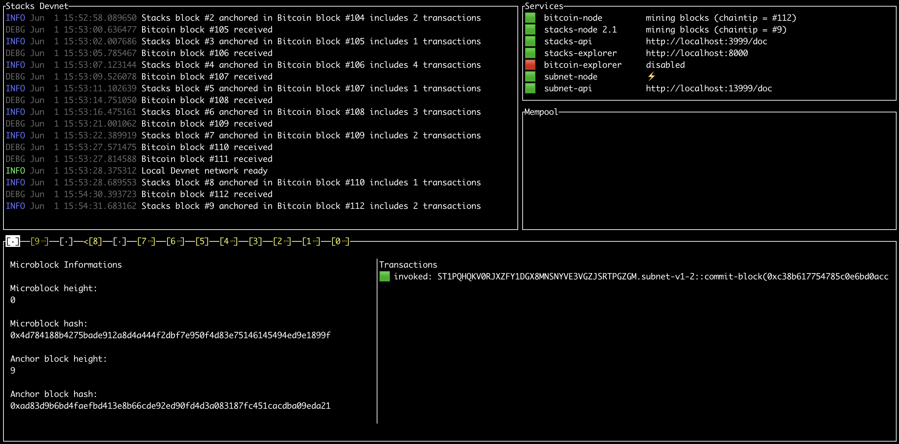

# Subnet Demo App

[See the Youtube Presentation](https://www.youtube.com/watch?v=FHKf-9C0LoI)

[Subnets](https://github.com/hirosystems/stacks-subnets#readme) are a layer-2 scaling solution in the Stacks blockchain. The Subnet demo app demonstrates subnets' capabilities through a simple hypothetical NFT marketplace where minting, listing, and offers happen on L2.
This demo application showcases how to mint NFTs, list, transfer, and withdraw them from the subnet back to the main chain. This demo application illustrates how wallets, exchanges, and developer teams can leverage subnets in their applications.

## Prerequisite

Clarinet version 1.6.2. You can follow the steps [here](https://docs.hiro.so/clarinet/getting-started#install-clarinet) to download the latest version of Clarinet.

## Features

- NFTs exchanges can happen on a subnet (L2)
  - Users can deposit their NFTs on the subnet
  - Then, they can receive offers or list their NFTs
- At any time, users can deposit or withdraw STX and NFTs on or from the subnet


## Project structure

- `./src` webapp
- `./clarity-l1` NFT contract to be deployed on stacks L1
- `./clarity-l2` NFT and marketplace contracts to be deployed on L2

:::note

The `clarity-l2` contracts have to be deployed manually, be can still be checked and tested with `clarinet`.
Clarinet's full support for subnets is in the roadmap. However, the `clarity-l2` contract can be deployed manually, then checked and tested with `clarinet`.

:::

## Start project locally

### Integrate Clarinet

In the `./clarity-l1` folder, run the following command:

```sh
clarinet integrate
```

If you find any errors, please refer to our [troubleshooting guide](https://docs.hiro.so/clarinet/troubleshooting).

Wait a few minutes, as the subnet node reaches Stacks block 9.



Go to `clarity-l2/scripts/`.

First, install the script dependencies:

```sh
npm ci
```

Deposit some STX on the subnet by using the following command:

```sh
node ./fund.js
```
The output of the above command is a `txid`. You can explore more about the transaction by following the links in the services section of the clarinet integrate. The instructions for the same are documented [here](https://docs.hiro.so/subnets/getting-started#interacting-with-the-subnet).

Wait a couple of minutes for the funds to transfer. Then, publish the l2 contracts.

```sh
node ./publish.js subnet-demo-marketplace ../contracts/subnet-demo-marketplace.clar 0
node ./publish.js parfait-nft ../contracts/parfait-nft-l2.clar 1
```

Register the nft contract on the subnet:

```sh
node ./register.js
```

## Run the front app

In the repo root `./` run

```sh
npm ci # install dependencies
npm run dev
```

The `npm run dev` command outputs a local link.

## Add the local subnet to your Hiro Wallet

Add a network to your Hiro wallet. Make sure the *network* and the *key* match. For example, "subnet". 
The URL is `http://localhost:13999`.
